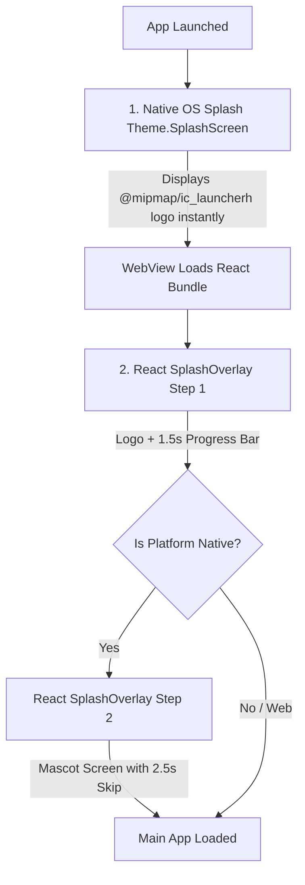

# Teaching LLM - System Documentation

Welcome to the comprehensive system documentation for the **Teaching LLM** platform. This document serves as the single source of truth for the entire architecture, data models, features, and deployment structure of the application. It is designed for developers, managers, and technical stakeholders to fully understand how the system operates without needing to read the source code.

---

## 1. System Overview

**Teaching LLM** is a comprehensive Learning Management System (LMS) built for educational organizations to manage students, instructors, courses, live sessions, exams, and community interactions. 

The system leverages a modern full-stack TypeScript architecture, using Next.js for both the frontend (App Router) and API backend. It uses a relational PostgreSQL database managed through Prisma ORM and relies on JWT-based authentication via HTTP-only cookies. To provide real-time capabilities and prevent server overload, the system uses Server-Sent Events (SSE) for community messaging, Upstash Redis for global rate limiting and maintenance toggles, and a specialized delayed synchronization queue for background operations.

### Major Components Interplay
1. **Client Browser (Frontend):** Renders the UI using React/Next.js. Uses SWR for client-side data fetching and caching, and native EventSource for SSE real-time community chat.
2. **Next.js Backend (API & Server Actions):** Handles all core business logic, from JWT parsing to database transactions. Includes a robust Edge Middleware for route protection, CSRF prevention, and rate-limiting.
3. **PostgreSQL Database:** The central nervous system storing all users, courses, content, metrics, logs, and relationships.
4. **Redis Cache (Upstash):** Used exclusively for system-level toggles (e.g., Global Maintenance Mode) and rate limiting (sliding window).

---

## 2. Architecture

### Tech Stack
- **Framework:** Next.js 14+ (App Router)
- **Language:** TypeScript
- **Database:** PostgreSQL (often hosted via Supabase or AWS RDS)
- **ORM:** Prisma ORM v5
- **Authentication:** Custom JWT-based Auth + Google OAuth (via standard routes)
- **Caching & Rate Limiting:** Upstash Redis (`@upstash/ratelimit`, `@upstash/redis`)
- **Styling:** Tailwind CSS (via `globals.css` and utility classes)
- **Real-Time Data:** Server-Sent Events (SSE) for zero-load real-time updates.

### Data Flow & Request Lifecycle
1. **Client Request Action:** User performs an action (e.g., submitting an exam, posting a chat).
2. **Middleware Interception:** `src/middleware.ts` intercepts the request. It verifies the HTTP-only JWT cookie (`teaching_llm_token`), checks for CSRF via the `x-requested-with` header, and applies Redis rate limits.
3. **API Route Handling:** The request hits a dedicated Next.js API route (`src/app/api/...`) or a Server Action.
4. **Business Logic & DB Transaction:** The backend validates payload limits, ensures role-based authorization using `src/lib/auth.ts`, and interacts with the database using Prisma (`src/lib/db.ts`).
5. **Activity Logging:** Most write operations trigger an audit log insertion into the `ActivityLog` table (`src/lib/activity-log.ts`).
6. **Response & Client Hydration:** The backend returns JSON responses, which SWR catches on the frontend to automatically hydrate and re-render the necessary components securely (protected by a custom `HydrationGuard`).

---

## 3. Roles & Permissions

The system explicitly defines four internal roles, each with strict system behaviors.

- **STUDENT:**
  - *Behavior:* Can view enrolled courses, participate in community chats, take exams, and submit support tickets.
  - *Restrictions:* Cannot access `/manage` or `/admin` routes. Data access is strictly compartmentalized based on the `Enrollment` table. Token invalidation is immediate if terminated.
- **INSTRUCTOR:**
  - *Behavior:* Assigned to specific courses via `InstructorAssignment`. Can schedule `CourseEvents` (live sessions), manage study materials, and answer queries.
  - *Restrictions:* Cannot assign enrollments or create generalized system announcements. Accessible course scope is limited to active assignments.
- **MANAGER:**
  - *Behavior:* Has overarching, generalized access. Can create courses, assign students, ban/terminate users, manage global announcements, view analytics, and control global system states.
  - *Restrictions:* Bypasses course enrollment barriers (implicitly has access to all data). Maintains the system.
- **ADMIN:**
  - *Behavior:* Technical administrators with similar or greater privileges than MANAGERS, typically controlling the DevOps integrations, database backups, and high-level platform scaling.

*Enforcement:* Enforced strictly in Edge Middleware and API controllers.

---

## 4. Feature-by-Feature Breakdown

### 4.1 Courses & Bundles
- **What it does:** Allows the creation of primary educational containers (Courses) and grouped packages (CourseBundles).
- **Internals:** Courses include topics, content (lectures, PDFs), and live events. Students are mapped to courses via the `Enrollment` table. Bundles map to Courses via `CourseBundleCourse` and assign users via `UserCourseBundleAssignment`. Custom fields track demo statuses and expiry dates.

### 4.2 Exams & Evaluations
- **What it does:** Facilitates structured testing (MCQs, subjects) with countdown timers and automated/manual grading.
- **Internals:** `Exam` links to `ExamQuestion`. When a student starts, an `ExamAttempt` is recorded. Timers rely on absolute server-time synchronization. Responses are stored in `ExamResponse`.
- **Edge cases:** Exam auto-submission triggers when time elapses; UI hides results until explicitly published by the Manager.

### 4.3 Community & Real-Time Chat
- **What it does:** Per-course chat rooms resembling modern messaging apps.
- **Internals:** Uses Server-Sent Events (SSE) via `community/[courseId]/messages/stream/route.ts` instead of SWR polling to minimize DB load. Caches active connection streams in memory.

### 4.4 Live Sessions & Scheduling
- **What it does:** Scheduling system for virtual classes.
- **Internals:** Uses `CourseEvent` model. Tracks specific times, recurrences, and syncs historical snapshots to `DailySessionSnapshot` for payroll and auditing.

### 4.5 Support Ticketing
- **What it does:** Helpdesk for students to contact administration.
- **Internals:** Uses `SupportTicket` and `TicketReply`. Assigns priority and statuses. Only visible to the assigned Manager and the submitting student.

### 4.6 Global Announcements, System Updates & Maintenance
- **What it does:** Push notifications, active site banners, polls, and the "Maintenance Mode" wall.
- **Internals:** Handled via Redis singleton (`MAINTENANCE_KEY`) and `SystemUpdate`/`Announcement` tables.

---

## 5. UI/UX Behavior

- **Student Journey:** Logs in -> Lands on Dashboard. Displays upcoming live sessions (calculated via IST standard), pending exams, and unread notifications. Navigation avoids complex multi-layer menus, focusing on active "Cards". SWR caching ensures fast transitions.
- **Manager Journey:** Gets access to the `/manage` directory. Can pull chat transcripts, check global system health, force sync queues, override maintenance mode (Managers bypass maintenance mode restrictions natively to execute fixes).
- **Hydration & State Loading:** A global `<HydrationGuard>` blocks mismatch rendering on initial page load, preventing the "removeChild on Node" crash by enforcing client-side hydration delays.

---

## 6. Configuration & Environment

### Environment Variables
- `DATABASE_URL`: Connection string to PostgreSQL (used by Prisma).
- `JWT_SECRET`: 256-bit+ cryptographic key used to sign session cookies.
- `UPSTASH_REDIS_REST_URL` & `UPSTASH_REDIS_REST_TOKEN`: Credentials for Upstash ratelimits/maintenance caching.
- `CRON_SECRET`: Special token to authenticate background trigger requests.

### External Services
- **Google OAuth:** Used for seamless student registration. (Maps Google email to DB, auto-enrolls into demo courses via the `isDemo` flag).
- **Vercel / Render:** Deployment target. Compatible with edge configurations.

---

## 7. Database Documentation (Core Schema)

*Managed via `prisma/schema.prisma`.*

1. **`User` Table:** Central entity. Tracks role, basic info, and security parameters (`tokenVersion`, `violationCount`, `isTerminated`).
2. **`Course` Table:** The "Class". Has flags for `isDisabled`, `isDemo`, `isCommunityActive`.
3. **`Enrollment` & `InstructorAssignment`:** Many-to-many link tables connecting `User` to `Course`.
4. **`CourseEvent` & `DailySessionSnapshot`:** Stores calendar components. Snapshots retain historical validity if a primary event is deleted or altered.
5. **`Content` & `Topic`:** Curriculum structures attached to courses. Supports video URLs and PPT downloads.
6. **`Exam`, `ExamQuestion`, `ExamAttempt`, `ExamResponse`:** The quad-relational structure managing assessments.
7. **`ActivityLog`:** Audit table for sensitive actions (login failures, deletion of content, system updates).
8. **`SyncQueue`:** Handles delayed, background tasks for user data synchronization.

---

## 8. API Documentation (Summary)

The backend utilizes `app/api/...` App Router handlers.

- **`/api/auth/login` (POST):** Validates credentials, compares bcrypt hashes, sets HTTP-only `teaching_llm_token` cookie. Rate limited.
- **`/api/auth/google` (POST):** Validates Google tokens, auto-registers, creates session.
- **`/api/community/[courseId]/messages/stream` (GET):** SSE endpoint. Maintains open HTTP connection for real-time chat pushing.
- **`/api/courses` (GET/POST):** Lists courses (filtered via DB enrollment relation for students) or creates new courses (Managers only).
- **`/api/exams/[id]/submit` (POST):** Accepts bulk answers. Verifies time limits internally before accepting.
- **`/api/sync-queue` (POST/GET):** Background endpoint. Triggered by a master cron. Iterates through pending `SyncQueue` DB items.
- **`/api/activity-logs` (GET):** Manager-only endpoint to pull system audit trails.

*Security Note:* All mutating APIs (POST/PUT/DELETE commands) enforce a mandatory `X-Requested-With: XMLHttpRequest` header to strictly combat cross-site request forgery bounds.

---

## 9. System Rules & Limits (Critical)

1. **Global Rate Limiting (Redis/Upstash):**
   - General Writes (POST/PUT/DELETE): 20 requests per minute per User/IP.
   - Login Attempts: 5 requests per 15 minutes per IP.
   - Comments/Feedbacks: 1 request per 10 seconds (sliding window).
2. **Token Rotation & Expiry:**
   - JWTs expire in 24 hours.
   - Database tracking `tokenVersion` ensures force-logouts operate instantaneously across all devices.
3. **Character & Size limits:**
   - Managed directly on component layers and Prisma strings (implicitly standard Text). Large payloads are blocked inherently by Next.js body limits (~4MB).
4. **Timezone Standardization:**
   - Entire platform logic is standardized to `Asia/Kolkata` (IST) using integrated `date-fns` setups. UTC is handled in the DB but transformed immediately for business logic.

---

## 10. Background Processes / Sync Systems

- **Sync Queue Mechanism (`src/lib/sync-queue.ts`):** 
  - *Purpose:* Prevents DB locking and external API spikes during massive batch user operations (e.g., synchronizing hundreds of student records).
  - *Triggering:* A CRON job dynamically calls `/api/sync-queue` (secured by `CRON_SECRET`).
  - *Jitter Control:* Tasks are actively "staggered" with a 2-minute window and a random 5000ms jitter to spread server load mathematically.
  - *Failure Handling:* The `isProcessed` flag maintains task state. Unprocessed rows are picked up in the next loop.

---

## 11. Error Handling & Logging

- **Frontend:** Hydration Guards capture UI inconsistencies. Generic `ErrorBoundary` components wrap major blocks. SWR standardizes fetch failures.
- **Backend:** Try/Catch blocks uniformly return JSON: `{ error: string }` with appropriate status codes (400, 401, 403, 404, 500).
- **Activity Logging:** Critical actions run through `src/lib/activity-log.ts` to log context (`moduleName`, `actionType`, `isFailure`). This is viewable entirely within the Manager Dashboard for real-time site monitoring.

---

## 12. Security Model

- **Session Security:** Strict JWT implementation. Tokens only exist in `Secure`, `HttpOnly`, `Lax` cookies. `FullSession` database checks pair with the middleware edge checks to secure compromised payloads.
- **CSRF Combat:** Unique requirement of Javascript-only headers for non-GET requests forces cross-domain exploitation to fail instantly.
- **RBAC (Role Based Access Control):** Defined hierarchically. Middleware drops explicit URL navigation out of bounds (`/manager` blocks students). APIs internally double-check database enrollment bounds even if the URL passes.

---

## 13. Deployment & DevOps

Deployments trigger traditionally.
1. `npm install`
2. `npx prisma generate` (vital step managed in `postinstall` script).
3. `next build` -> Translates server actions, optimizing client boundaries.
4. `next start` or PM2 mapping.
5. **Database Updates:** `npx prisma db push` or `npx prisma migrate deploy` for staging tables.

*Important:* Do not modify environment variables without rebuilding the Next cache for Edge variables (`JWT_SECRET` usually processes dynamically).

---

## 14. Maintenance & Admin Controls

Managers access a specialized GUI (`/manage`). 
- Features include the **Maintenance Mode Toggle**, which manipulates the Upstash Redis boolean flag. 
- Real-time **System Update Notifications** (active banners) can be spawned globally or pinpointed by course IDs.
- Direct **Activity Monitoring** visualizes precisely which component or which user is causing elevated failures.

---

## 15. Known Issues / Risks

- **Connection Saturation via SSE (Server-Sent Events):** SSE instances keep a PHP/Node request continually alive. While lightweight compared to websockets, mass concurrent connections in community hubs could bottleneck Node thread pools on small VPS instances.
- **Token Version Invalidation Race Conditions:** Rare edge cases exist where concurrent requests right at the exact millisecond a `tokenVersion` increments could fail violently or pass an old state.
- **Prisma Bundle Size:** Extensive client generation causes heavy memory requirements during Next.js build phases. Ensure CI/CD platforms have at minimum 2GB RAM.

---

## 16. Splash Screen & Native Caching System

### 16.1 Project Context & Mobile Shell
The mobile application is packaged using **Capacitor** which wraps the Next.js web application inside an Android WebView shell. Because the WebView loads its resources over the network (pointing to the production server `https://class.genziitian.in` or test server `https://teaching-llm.onrender.com`), the application boot sequence involves a network/loading lag before React boots up.

---

### 16.2 Splash Screen Lifecycle & The "White Screen" Fix

The app implements a two-stage splash screen sequence to ensure a premium, instant-load branding experience:

#### 1. Native OS Splash Screen (Android `Theme.SplashScreen`)
* **Purpose:** Displays immediately on app launch while the WebView is loading the Next.js Javascript bundle in the background.
* **The "White Screen" Issue:** Previously, the native theme in `android/app/src/main/res/values/styles.xml` configured `windowSplashScreenAnimatedIcon` as `@android:color/transparent`. This caused the app to show a blank white screen for 3–5 seconds during boot.
* **The Solution:** Updated the configuration to use the app launcher logo (`@mipmap/ic_launcherh`). Now, the logo is displayed immediately upon clicking the app icon, providing instant visual feedback.

#### 2. React Splash Overlay (`src/components/SplashOverlay.tsx`)
* **Step 1 (Logo & Loading Bar):** Runs for exactly 1.5 seconds, displaying the *GenZ IITIAN* logo and a smooth red loading bar.
* **Step 2 (Mascot Screen & Skip Button):**
  * **On Native Mobile:** Shows a responsive full-bleed mascot graphic with a translucent "Skip" button in the top-right corner. It closes automatically after 2.5 seconds or immediately when "Skip" is clicked.
  * **On Desktop Website:** Bypasses Step 2 completely and fades out immediately after Step 1 to avoid interrupting the desktop user experience.

---

### 16.3 Local Asset Caching System (`src/hooks/useLocalCachedAsset.ts`)

To avoid downloading heavy assets (e.g., logo, mascot images) every time the app opens over the WebView, the app uses a custom React caching hook:

* **Platform-Aware:** Detects if the platform is native Android. On desktop/browsers, it falls back instantly to standard remote HTTP URLs.
* **Device Storage Caching:** Downloads heavy image blobs to the device’s data storage (`Directory.Data` via `@capacitor/filesystem`) on first launch and registers them.
* **Instant Offline Load:** On subsequent app launches, it resolves the images offline using `Capacitor.convertFileSrc`, loading them instantly without network delay.
* **Cache Invalidation:** Includes version-based cache invalidation. During new app updates, the old cache is cleared, and assets are updated.

---
*Generated by AI documentation system. Maintain routinely for optimal architecture clarity.*
